# 42028
# Deep Learning and Convolutional Neural Networks
# Assignment 3
### Group 19
### Face the Facts
## Table of Contents
## Contributors
| name | email | github | id |
| ---- | ----- | ------ | ---------- |
| Harrison Cole | [email](mailto:harrisoncole05@gmail.com) | [Hc747](https://github.com/Hc747) | 12962712 |
| Jihee Lee | [email](mailto:13826920@student.uts.edu.au) | [GRORY](https://github.com/GRORY) | 13826920 |
| Jose Meza | [email](mailto:josemezag@gmail.com) | [jose-meza-garcia](https://github.com/jose-meza-garcia) | 13093099 |
## About
The wearing of face masks in public spaces has become a normal, if not mandatory, aspect of daily life in most countries around the world.
The proper usage of face masks has been demonstrated to be an effective measure in controlling the spread of the coronavirus disease (COVID-19).

Our project delivers a tool that is capable of locating faces within images and videos, detecting if face masks are present, and detecting if they are being worn correctly.

This application is an example of a tool that could be deployed in public spaces (i.e., shopping centres, airports, public transport) in order to provide interested parties with analytical and/or monitoring capabilities.
This tool _does not_ provide interested parties with the ability to correlate faces with identities.
### Datasets
| [Cabani](https://github.com/cabani/MaskedFace-Net) | [Ashish](https://www.kaggle.com/ashishjangra27/face-mask-12k-images-dataset) | [Flickr](https://github.com/NVlabs/ffhq-dataset) |
| -------------------------------------------------- | ---------------------------------------------------------------------------- | ------------------------------------------------ |

| 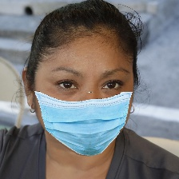 | 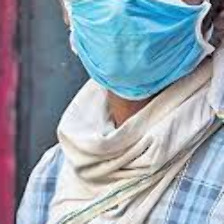 |  |
| ---------------------------| ---------------------------| ---------------------------|
|  | 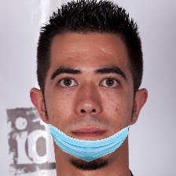 | 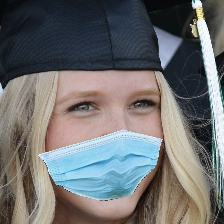 |
|  | 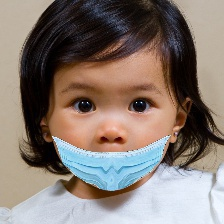 | 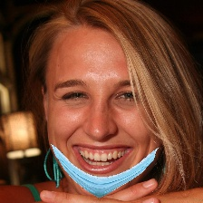 |

### Libraries
| [TensorFlow](https://github.com/tensorflow/tensorflow) | [MediaPipe](https://github.com/google/mediapipe) | [Dlib](https://github.com/davisking/dlib) |
| ------------------------------------------------------ | ------------------------------------------------ | ------------------------------------------|
### Architecture

## Getting Started
### Install
```python
pip install -r requirements.txt
```
### Run
```shell
python main.py
```
### Screenshots
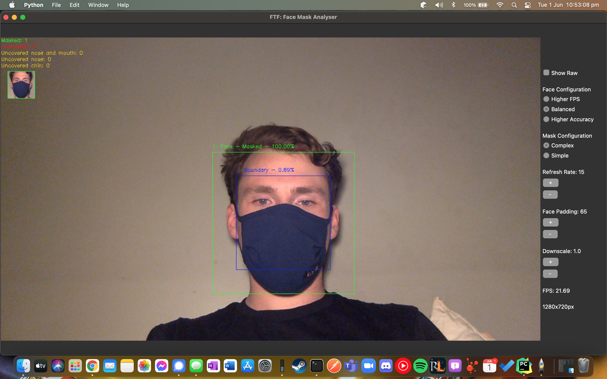
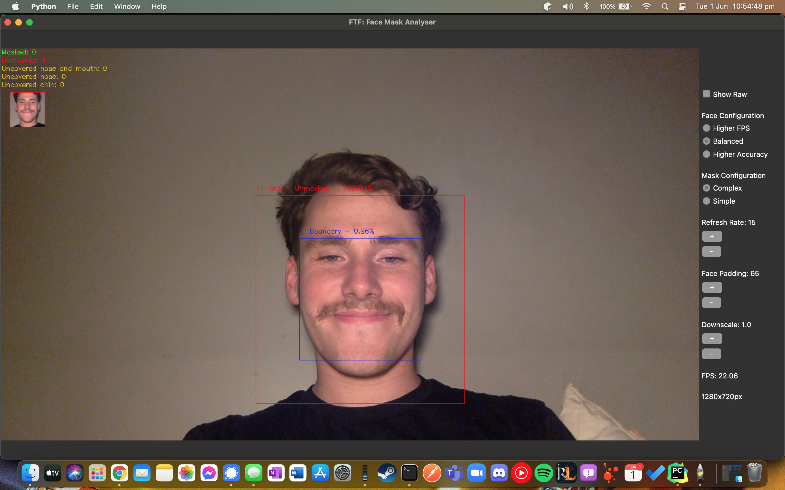
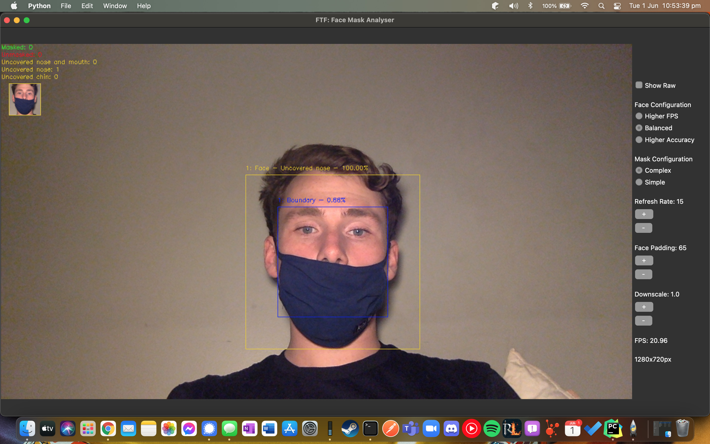
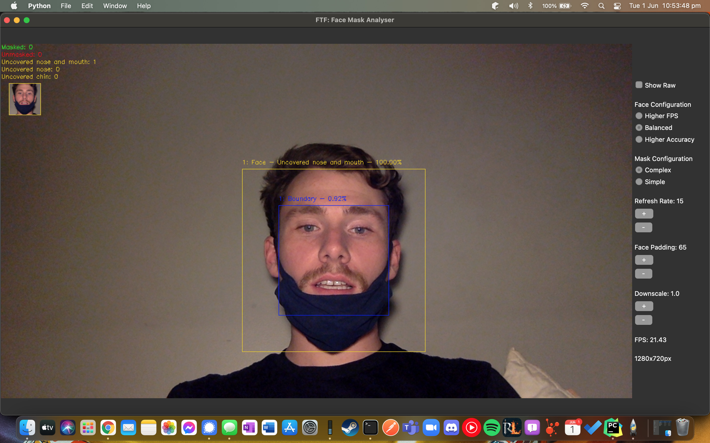
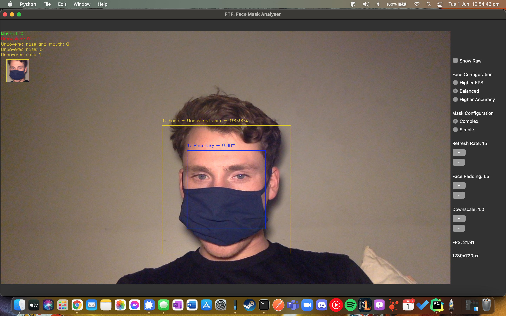
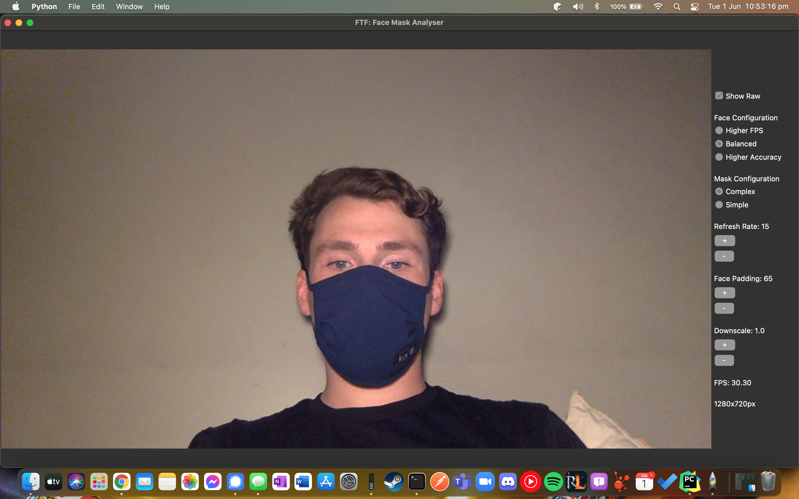
